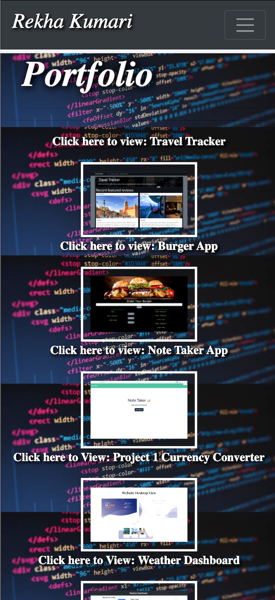
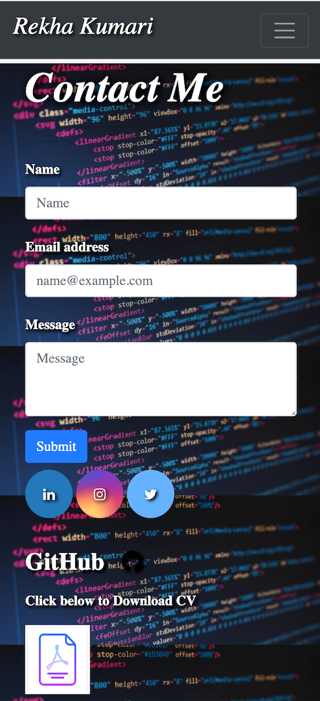

--------------------------------------------------------------------------------------------------------------------------------------------------------------------

### Website Title and Description

## Responsive Portfoilo

Rekha Kumari’s Portfolio: This is my personal website developed for future employers to be able to access my projects and contact me. My website has Bootstrap components and grid system.
Feel free to take a look at my portfolio, you will see a whole heap of projects i've worked on, any questions feel free to contact me on the link below.

# How to access?
The website can be found at the following address: https://nikstar-1.github.io/02-Responsive-Portfolio/

## Screenshots:

 The website has been developed in the following ways:

- Navbar on each page contains links to Home/About, Contact, and portfolio pages, workable and consistent on each page.
- Responsive layout across all pages to fit XS screens as well as desktop allowing for margins on the left and right of my screen.
- Responsive Images
- Each page has semantic html
- Contains personal information 

This project has been an exciting, and challenging development, enjoyed using bootstrap components, slightly tricky at first but enjoyed learning as I went along. 

--------------------------------------------------------------------------------------------------------------------------------------------------------------------

